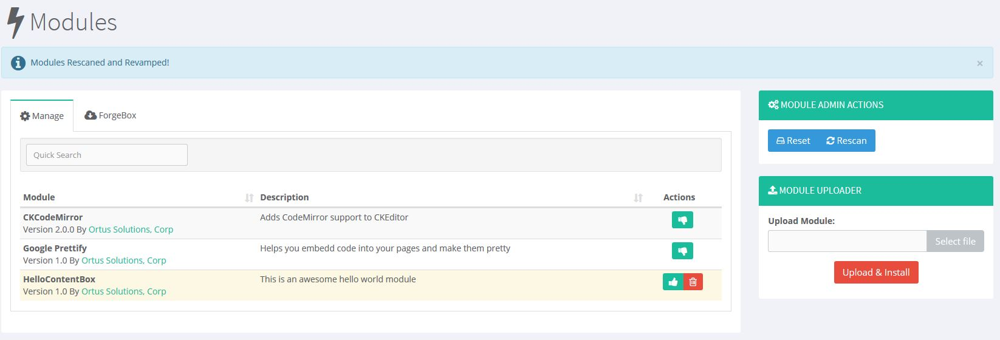
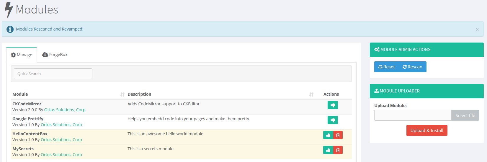
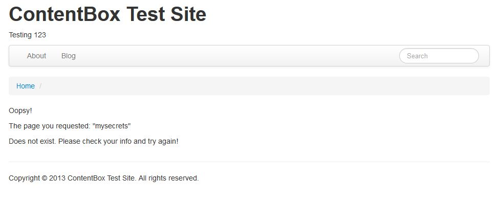
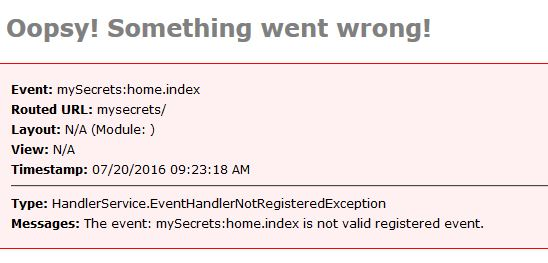

# Build an Admin Module

ContentBox makes it easy to create your own Admin Modules, add Menu Items into the Admin Interface, use ContentBox Admin Users and Permissions instead of building your own security by extending ContentBox.

At it's core, ContentBox is an Application running on top of ColdBox as a framework, but with all of the great features ContentBox has, ORM, Pages, Blog Posts, Categories, Comments, Subscriptions, Admin User Interface, Permissions, Modules, and much more, you can treat ContentBox like an Application Framework, and just extend it, with Modules. With almost every real Application, you will need to add front end modules, and then admin modules.

When you are building admin modules, you need to build / install those modules into the `modules/contentbox/modules_user` folder or `modules/contentbox/modules` folder. Read Module Conventions to know when to use what folder... depending if the module will be custom, vs a shared forgebox module, you should put them in different locations.

One big benefits with ContentBox, is how easy it is to use the base admin, and extend it to make it your own admin. Why build a normal website the hard way, when ContentBox already has all the login, password reset, security roles and permissions build for you. Can you simply use the admin, and add more buttons for your admin modules. 

This pade walks through building a simple module in the ContentBox admin. We're going to make a custom module, that will only live with this application, and will not be shared with forgebox, so we want this to be included in our source code. So we will build this module in this folder:

`/modules/contentbox/modules_user/`

The full path of our module, which will be called mySecrets would be

`/modules/contentbox/modules_user/mySecrets`

Now, if we go to the Module Manager in the backend, and rescan for modules, you will see it doesn't show up yet.



First, we need to create a module config. This is similar to a normal ColdBox module, with a few extra splashes of flavor for ContentBox. 
Since it is a CFC, we can use the pseudo contructor to set the module properties. For mySecrets, it looks something like this.

```
// Module Properties
this.title                       = "MySecrets";
this.author                = "Ortus Solutions, Corp";
this.webURL                = "http://www.ortussolutions.com";
this.description           = "This is a secrets module";
this.version               = "1.0";
 
// If true, looks for views in the parent first, if not found, then in the module. Else vice-versa
this.viewParentLookup      = true;
 
// If true, looks for layouts in the parent first, if not found, then in module. Else vice-versa
this.layoutParentLookup = true;
 
// Module Entry Point
this.entryPoint                  = "mysecrets";
```

The only required function for the ModuleConfig.cfc is the configure() function. This is where you can set ( or inherit ) settings, parent settings, layout settings, datasources, webservices, routes, interceptorSettings, custom Interceptors and Interception Points, model bindings ( mappings ). A shell of your configure method might look like this.
```
function configure(){
      // parent settings
      parentSettings = {
      };
      // module settings - stored in modules.name.settings
      settings = {
      };
      // Layout Settings
      layoutSettings = {
             defaultLayout = ""
      };
      // datasources
      datasources = {
      };
      // web services
      webservices = {
      };
      // SES Routes
      routes = [
             // Module Entry Point
             {pattern="/", handler="home",action="index"},
             // Convention Route
             {pattern="/:handler/:action?"}
      ];
      // Custom Declared Points
      interceptorSettings = {
             customInterceptionPoints = ""
      };
      // Custom Declared Interceptors
      interceptors = [
      ];
      // Binder Mappings
      // binder.map( "Alias" ).to( "#moduleMapping#.model.MyService" );
}
```

This is the minimum you need for the module to show up in the Manage Modules screen. If we rescan now, you'll see it detects our Module.



When you click the Thumb Up icon to activate, it activates the module.


Since these modules are inside of ContentBox, Contentbox manages loading and unloading the module, as well as activating and deactivating the modules, so you need those functions to listen for those events. ModuleConfig.cfc is one big interceptor, so you can catch all sorts of interception points, but these are the four needed for a ContentBox Module to function to its fullest.

```	
/**
* Fired when the module is registered and activated.
*/
function onLoad(){
}
 
/**
* Fired when the module is activated by ContentBox
*/
function onActivate(){
}
 
/**
* Fired when the module is unregistered and unloaded
*/
function onUnload(){
}
 
/**
* Fired when the module is deactivated by ContentBox
*/
function onDeactivate(){
}
```

This is a bare bones template for a module controlled by ContentBox, but right now it doesn't really do anything... in fact if you tried to hit the module, the default route for / would look for home hander with index action/view but we haven't created those yet. None of the functions above do anything, so all the activation and deactivation does, is make the module available or not. If you try and access /mysecrets ( the entry point ) with the module deactivated you see this



When the module is activated, and you hit the entry point, you will get the error that the event is not a valid registered event



Here is the gist of step 1.
ModuleConfig.CFC for Step 1 - https://gist.github.com/gpickin/545242a3da6c2805efb4e6cac82ce1ad

