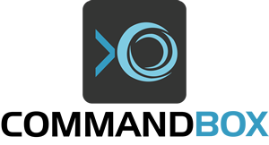
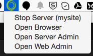

# Installation using CommandBox



[CommandBox](http://www.ortussolutions.com/products/commandbox) is a ColdFusion (CFML) Command Line Interface (CLI), REPL, Package Manager and Embedded Server.  We will leverage the CLI in CommandBox to install, deploy and configure ContentBox.  The full CommandBox installation instructions can be found here: http://commandbox.ortusbooks.com/content/setup/installation.html.  We will do the short version.


## Download CommandBox
You can download CommandBox from the official site: http://www.ortussolutions.com/products/commandbox#download and install in your preferred Operating System (Windows, Mac, *unix).  CommandBox comes in two flavors:

1. No Java Runtime (30mb)
2. Embedded Runtime (80mb)

So make sure you choose your desired installation path and follow the instructions here: [http://commandbox.ortusbooks.com/content/setup/installation.html](http://commandbox.ortusbooks.com/content/setup/installation.html)


## Starting CommandBox
Once you download and expand CommandBox you will have the `box.exe` or `box` binary, which you can place in your Windows Path or *Unix `/usr/bin` folder to have it available system wide.  Then just open the binary and CommandBox will unpack itself your user's directory: `{User}/.CommandBox`.  This happens only once and the next thing you know, you are in the CommandBox interactive shell!


We will be able to execute a-la-carte commands from our command line or go into the interactive shell for multiple commands.  We recommend the interactive shell as it is faster and can remain open in your project root.

## Creating A ContentBox Site

Now that we have CommandBox we can use it to install and execute a ContentBox site using the embedded server.  You can use an embedded database or connect the embedded server to any database server as well.  Open a CommandBox shell in your directory of choice by typing `box` or executing the `box` binary and after the welcome screen type the following commands:

```
mkdir mysite --cd
install contentbox
server start --rewritesEnable
```

> **Note** You can install the bleeding edge of ContentBox by using the `contentbox-be` slug instead of `contentbox` in the install command.

This will install the latest stable ContentBox and run an embedded server (lucee) for it.  After this you will get the ContenBox installer.  Just follow it through.


> **Danger** We recommend that after you install ContentBox that you remove the installer and datsource wizard modules from disk.  You can do so manually or via the Dashboard once you log in. `{Root}/modules/contentbox-installer and {Root}/modules/contentbox-dsncreator`


## Custom Datasources

To change the datasource you can go into the CFML engine administrator and change it.  Just look in your taskbar for an Ortus Logo like the one below:



Click on `open web admin` and go into the datasources section and create one.