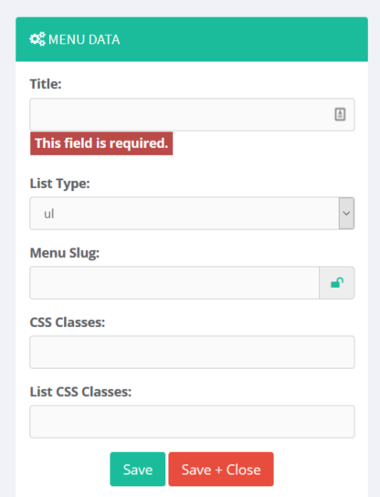
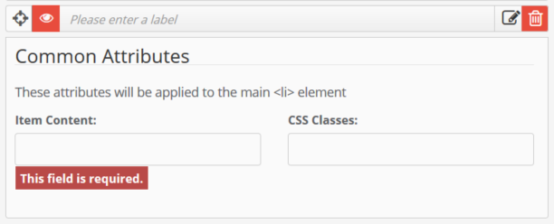
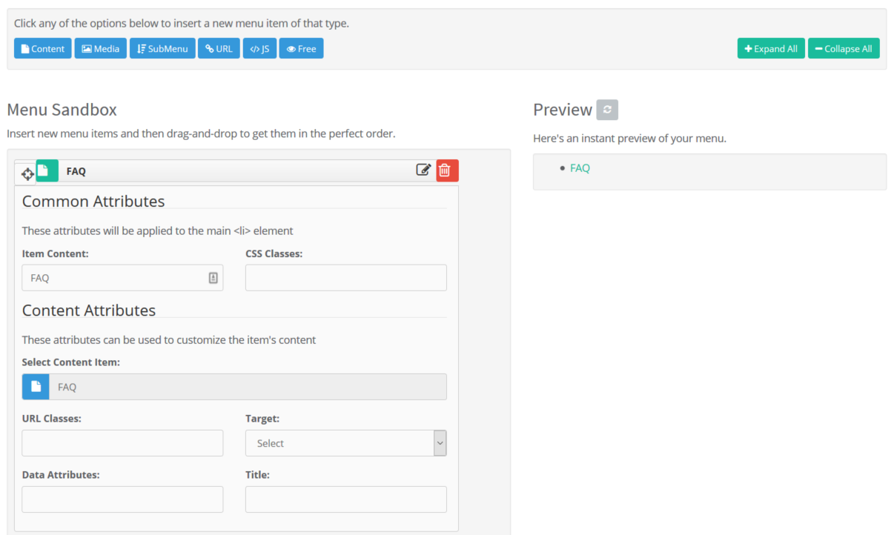

# ContentBox Menu Manager

The menu manager allows you to create 'Menus' to be used in a variety of ways in your ContentBox Website. A Menu can contains several Items, which can be from a range of Item types, Content like Pages and Blog posts, Media, Submenus, URLs, JS or Free type. Menus are easy to create, and give you a lot more options that relying on pages inside your traditional Sitemap structure.

By default, ContentBox sites use the Sitemap to generate a menu for display. To use a Menu instead of the Sitemap, you have to install a Theme which supports Menus, and then select the Menu you wish to use as you main site Menu.

Some Themes may support additional menus for top menus, footer menus, side bar menus. Please refer to your Theme.

## Menu Data

- Title: The name of the Menu
- List Type: ( ul | ol ) Unordered List or Ordered List
- Menu Slug: This is the code referenced slug, to be used to retrieve the Menu in the Theme or View, where required.
- CSS Classes: Optional CSS Classes to be added to the Main Menu List itself ( ul or ol - when supported by the Theme )
- List CSS Classes: Optional CSS Classes to be added to each of the List Items ( li - when supported by the Theme )

## Item Types

- Content
- Media
- Submenu
- URL
- JS
- Free

Each content type has it's own set of attributes.

#### Common Attributes (Shared by all Item Types)
- Label - Read Only - Same as the Item Content field below.
- Item Content - This is Name/Title that shows in the Menu Item itself. 
- CSS Classes - Optional additional CSS classes to be added to the list item

### Type: Content

Content refers to a Page, or Blog Entry. You can search and select the content item you wish this item to link to. The Item Content ( visible label for the menu item ) automatically populates when you select an item for Content Item.

In Addition to the Common Attributes listed above, this type also includes:
- Content - This is a search and selection tool to help you select a page or blog entry for this Menu Item to link to.
- URL Classes - Additional CSS for this Menu Item's HTML Element
- Target - Allows you to select how the link is treated by the browser, allowing 
  - _self
  - _blank
  - _parent
  - _top
- Data Attributes - Allows you to add one or many data attributes for the menu item. You can use JSON ( {"me":"you"} ) or a comma-delimited list ( me=you,icecream=awesome )
- Title - A accessible title, commonly used by browsers as a tool tip.

### Type: Media

Refers to Media from the Media Manager

In Addition to the Common Attributes listed above, this type also includes:
- Media - This is a search and selection tool to help you select a media item from the Media Manager for this Menu Item to link to.
- URL Classes - Additional CSS for this Menu Item's HTML Element
- Target - Allows you to select how the link is treated by the browser, allowing 
  - _self
  - _blank
  - _parent
  - _top
- Data Attributes - Allows you to add one or many data attributes for the menu item. You can use JSON ( {"me":"you"} ) or a comma-delimited list ( me=you,icecream=awesome )
- Title - A accessible title, commonly used by browsers as a tool tip.

### Type: Submenu

A Submenu type allows you to select an entire Menu to be included in the current Menu, as a Menu Item.

In Addition to the Common Attributes listed above, this type also includes:
- Select Sub-menu - This is a drop down select list of all of the Menus available for selection.
- - Data Attributes - Allows you to add one or many data attributes for the menu item. You can use JSON ( {"me":"you"} ) or a comma-delimited list ( me=you,icecream=awesome )
- Title - A accessible title, commonly used by browsers as a tool tip.

*Note: This relies on the Theme you are using, to utilize this feature.*

### Type: URL

A URL allows you to add any linkable URL you might desire into your Menu.

In Addition to the Common Attributes listed above, this type also includes:
- URL - The URL you wish to use for this menu item
- URL Classes - Additional CSS for this Menu Item's HTML Element
- Target - Allows you to select how the link is treated by the browser, allowing 
  - _self
  - _blank
  - _parent
  - _top
- Data Attributes - Allows you to add one or many data attributes for the menu item. You can use JSON ( {"me":"you"} ) or a comma-delimited list ( me=you,icecream=awesome )
- Title - A accessible title, commonly used by browsers as a tool tip.

### Type: JS

Not all menu items will be Links to other HTTP resources, with todays applications, we are commonly using more and more JavaScript, and the Menu Manager allows you to add JavaScript into your Menu Items as well.

In Addition to the Common Attributes listed above, this type also includes:

- JavaScript Code - JavaScript to be excuted when this Menu Item is clicked.
- URL Classes - Additional CSS for this Menu Item's HTML Element
- Data Attributes - Allows you to add one or many data attributes for the menu item. You can use JSON ( {"me":"you"} ) or a comma-delimited list ( me=you,icecream=awesome )
- Title - A accessible title, commonly used by browsers as a tool tip.

### Type: Free

This is a menu item that creates a 'free-text' menu item.
This item only uses the common attributes, Item Content, and CSS Classes... listed above.

## Preview

As you add, edit, and delete Menu Items, you can preview those menu items in page. 
You can refresh the menu by clicking the refresh icon next to the title Preview if the preview has not updated as expected.

